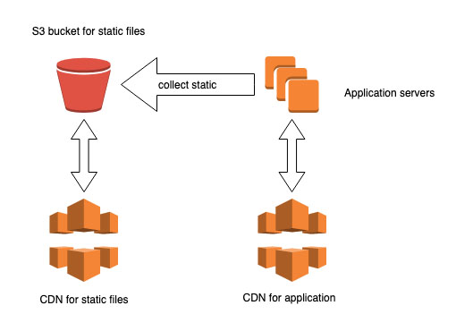

Django is a great Web framework for building Web applications in Python. It comes with a lot of batteries included that you'll most likely need at some point in your project. Two of them took me a while to differentiate when I started: static and media files.

After helping some less experienced people, I feel like I'm not the only one running into the confusion, so I'm hoping to clarify their differences in this post.

## TL;DR

Static files are part of your application code, while media is for generated content by your application or users of your application.

## Static files

Static files are managed by the [`staticfiles` app](https://docs.djangoproject.com/en/stable/ref/contrib/staticfiles/) which you need to install. It's made of several building blocks, the 3 most important ones being:

- Storage classes
- Templates tags
- `collectstatic` admin command

These components work together to serve the assets in a more or less optimised way, depending on the environment. This can be altered using the following settings:

- `STATIC_ROOT`
- `STATIC_URL`
- `STATICFILES_DIRS`
- `STATICFILES_STORAGE`

Static files are usually either part of your code, or part of your dependencies' code. They can come from various places, each app may provide its own files. They are typically kept in source control. The Django admin ships with some javascript and CSS, for example, that are stored [in Django's Github repository](https://github.com/django/django/tree/master/django/contrib/admin/static/admin).

### Local development setup

In development, [the setup for static files is inefficient and optimised for convenience](https://docs.djangoproject.com/en/stable/ref/contrib/staticfiles/#static-file-development-view). It’s based on a view that, by default, looks into all the installed apps to find static files. Works great for local development, but not ideal for production.

### Production setup

In production, finding files is done ahead of time via the `collectstatic` admin command, which you should run as part of your deployment. At a high level, the command does a very similar job as the development view, but the main difference is that it runs outside of the request-response cycle, without blocking the person visiting your website. It copies all the static files into a single location, being another folder or somewhere on another machine, which could be in a different part of the world.

My go-to solution for this used to be in [`django-storages`](https://pypi.org/project/django-storages/). It ships with a storage class for saving your files into AWS S3. I would also add a CDN in front to help caching the assets closer to my users. The setup looked like this:



However, recently I've switched to [Whitenoise](https://pypi.org/project/whitenoise/), which leads to a simpler setup, and remove the need for a S3 bucket, all hosting comes from the Django app. The CDN should serve most of the traffic anyway:


I still use `django-storages` but only for media files, which brings us to the next section...

## Media files

[Media files](https://docs.djangoproject.com/en/stable/topics/files/) are usually for files which are uploaded by users or generated by your application during the life of your Django project. They are typically not stored in source control.

This could be in the admin, the profile picture the user set in thei profile, some more private documents or a PDF receipt for an order that your app generate.

Basically, anything which is going into a `FileField`, `ImageField` or the likes is classified as media storage.

By default, files are stored on the local file system, and again a few settings are here to configure the behaviour:

- `MEDIA_ROOT`
- `MEDIA_URL`
- `DEFAULT_FILE_STORAGE`

In some production environments -if you run your app on Heroku for instance- this default setup is not suitable. Heroku has an ephemeral file system meaning that it's cleared each time the application is updated. This is where `django-storages` is still useful and needed.

If your app is hosting a mix of public and private medias, I recommend to define separate storage classes for each, you can tell in the field instantiation which storage class to use:

```python
class User:
    name = models.CharField()
    # public file
    profile_picture = models.ImageField(
        storage=PublicStorage()
    )
    # private file
    dbs_check_document = models.FileField(
        storage=PrivateStorage()
    )
```

The `django-storages` library has several backends for various hosting providers with a lot of options to customise them, so I won't go into the details of each, but here is an example of what it could look like for AWS:

```python
from storages.backends.s3boto3 import S3Boto3Storage


class PublicStorage(S3Boto3Storage):
    default_acl = 'public'
    file_overwrite = False
    bucket_name = 'my-public-bucket'


class PrivateStorage(S3Boto3Storage):
    default_acl = 'private'
    file_overwrite = False
    bucket_name = 'my-private-bucket'
```

### Use different class locally and in production

There is one problem with the above approach, though: by defining your storage class on the model field, that means it would potentially be shared between you local environment and production, which is probably not what you want. To solve this, we can use a factory function to either use the local file system or a remote location, depending on a setting:

```python
def get_storage(storage_type):
    if settings.USE_REMOTE_STORAGE:
        storage_class = {
            'private': PrivateStorage,
            'public': PublicStorage,
        }[storage_type]
        return storage_class()
    return FileSystemStorage()
```

Which would change your model definition to:

```python
class User:
    name = models.CharField()
    # public file
    profile_picture = models.ImageField(
        storage=get_storage('public')
    )
    # private file
    dbs_check_document = models.FileField(
        storage=get_storage('private')
    )
```

In a real world case, this helper should probably handle `KeyError` in the lookup and return the `DEFAULT_FILE_STORAGE`. You could also invent custom settings as you need.

## Security concerns

If you decide to use `django-storages` for both Static and Media files, it's important that you make the separation very clear, a user of your website shouldn't be able to override one of your static assets by uploading a resource! I like to use a separate S3 Bucket for each type of storage. AWS has many options to customise the privacy of buckets and the objects their contain, and other providers have equivalent features.

## Final note

While the Media storage might not be used by your application, the static files are a more essential, and any reasonable Django site will need it (at least for the admin).

I hope this post will help reduce the confusion I see frequently with beginners.
