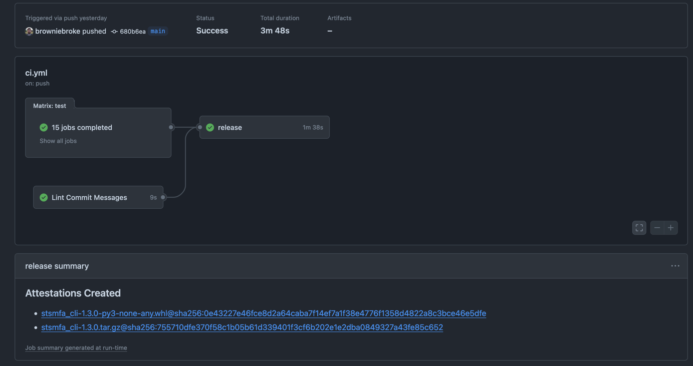

As you may have noticed, supply chain attacks ae on the rise. These attacks usually target a small piece of software infrastructure that the target depends on and inject some malicious code. They regularly make the news and this problem is becoming evermore present in a world where software relies more and more on open source. Supply chains can be difficult to audit and reading every line of code you depend can be very time consuming at best and practically impossible at worst (good luck with your `npm_modules` folder). The alternative of building software without any sort of dependencies is several order of magnitude harder.

There is an initiative to try to improve the current state of affairs and aim to make the supply chain easier to audit. One of the main output as it stands is the [SLSA specification](https://slsa.dev/spec/v1.0/), which provides guidelines to help both producers and consumers of software. I invite you to visit their website if you're interested to dive more.

I maintain a few Python packages, and while they're not used by many people, I wanted to explore what I could do as a maintainer to help the consumers of my packages. One thing that seems to gain traction is [the build provenance attestation](https://slsa.dev/spec/v1.0/provenance), which records where and how the package was built.

## Attest build provenance action

Conveniently, there is an [official GitHub action](https://github.com/actions/attest-build-provenance) for that, which seems easy to use:

> Ensure that the following permissions are set:
>
> ```yaml
> permissions:
>   id-token: write
>   attestations: write
> ```
>
> The id-token permission gives the action the ability to mint the OIDC token necessary to request a Sigstore signing certificate. The attestations permission is necessary to persist the attestation.
>
> Add the following to your workflow after your artifact has been built:
>
> ```yaml
> - uses: actions/attest-build-provenance@v1
>   with:
>     subject-path: "<PATH TO ARTIFACT>"
> ```
>
> The subject-path parameter should identify the artifact for which you want to generate an attestation.

Cool, so it seems like I just need to point my wheel and source distribution at the subject path, and we're good? Let's try it!

## Integration with my project

I already build my packages on CI, using [PyPI's trusted publisher](https://docs.pypi.org/trusted-publishers/), and my publish job looks something like this (this is a simplified example, omitted some parts for brevity):

```yaml
jobs:
  publish:
    name: Publish package
    runs-on: ubuntu-latest
    permissions:
      id-token: write
    steps:
      - name: Build package
        run: poetry build

      - name: Publish package distributions to PyPI
        uses: pypa/gh-action-pypi-publish@release/v1
```

The key point, is that after I run `poetry build`, my CI worker has a `dist/` folder with the packages files, that the following step is uploading to PyPI. I use Poetry, but most Python packaging tools use this convention, I think.

Following the guide from the previous section, I get:

```yaml {7,12-14}
jobs:
  publish:
    name: Publish package
    runs-on: ubuntu-latest
    permissions:
      id-token: write
      attestations: write
    steps:
      - name: Build package
        run: poetry build

      - uses: actions/attest-build-provenance@v1
        with:
          subject-path: "dist/*"

      - name: Publish package distributions to PyPI
        uses: pypa/gh-action-pypi-publish@release/v1
```

I made [the change on one of my repos](https://github.com/browniebroke/stsmfa-cli/pull/692), and made a new PyPI release to test it, and the build finished with a new dedicated attestation section:



I also noticed that there is [new page on my repo](https://github.com/browniebroke/stsmfa-cli/attestations) listing all the attestations.

## Conclusion

I first heard about this a few weeks back and wanted to try it, and it seemed more complicated at first glance, but it was in fact pretty easy to do. I've also updated my [python package template](https://github.com/browniebroke/pypackage-template/pull/785) so all my projects should be using that moving forward.

I'm not entirely clear whether this will be integrated deeper into PyPI at some point, but this is still early days.
