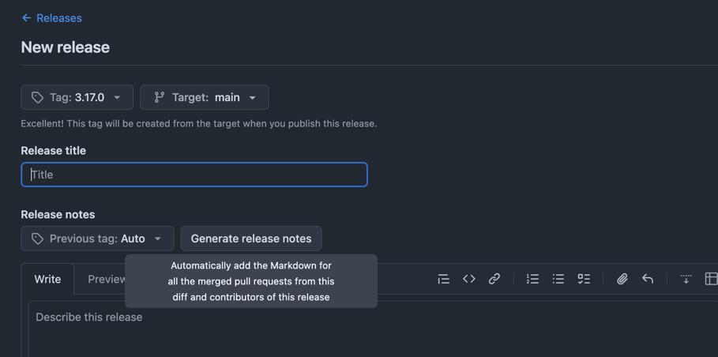

On a few projects, I've been using the GitHub automatic release notes generations for while to get a list of all the changes that have been merged since the last release:

I believe it's generated from the title of all the PRs which have been merged since the last release, and I usually need to edit it manually to omit internal changes which don't impact the code installed by the users, like dependabot updates.

I only discovered today that [this is configurable](https://docs.github.com/en/repositories/releasing-projects-on-github/automatically-generated-release-notes#configuring-automatically-generated-release-notes) to exclude some authors or labels automatically. This is achieved via the `.github/release.yml`.

I stumbled upon this feature after seeing the config file [edited in the `pyproject-fmt` project](https://github.com/tox-dev/pyproject-fmt/commit/7a3d989b66e18d1350aa8073b13c14894eeb0864).
