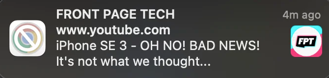

Occasionally, on macOS, I get some notifications with the app logo is crossed out, like this:



<br />

I thought it was because of permissions issues, but couldn't find the problem in my settings. Turns out, the fix is to kill the Notification Center, and let it starts again automatically. This can be done via the Activity Monitor, or via the command line:

```bash
killall NotificationCenter
```

I found the solution [on Reddit](https://www.reddit.com/r/mac/comments/qghppk/chrome_logo_is_crossed_out_for_some_reason_in/), but since I'll inevitably have forgotten next time it happens, making note of it here.
